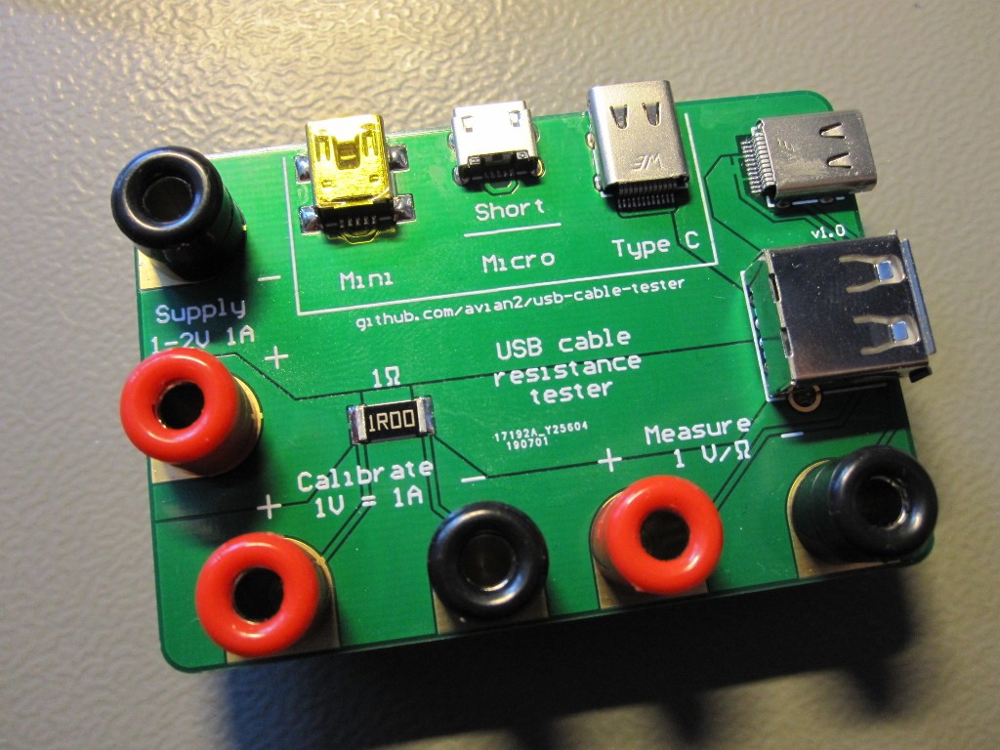
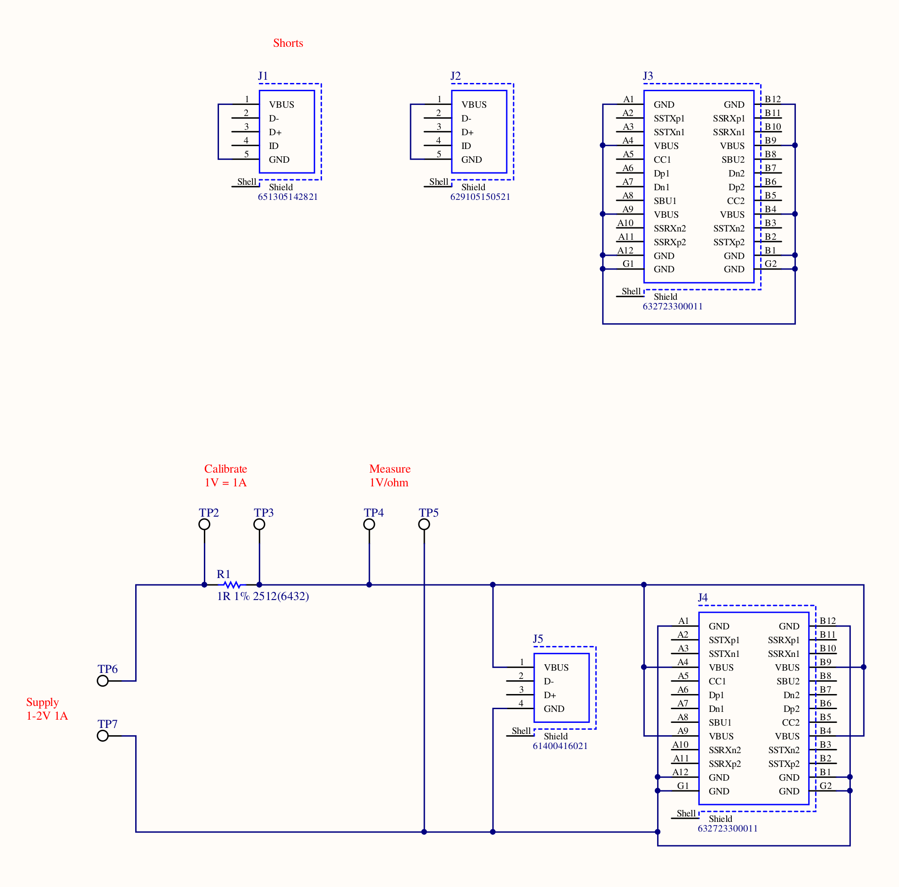

# A tool for measuring USB cable resistance

This is a tool for measuring USB cable resistance very similar to the [FemtoCow's cable resistance tester][1]. It supports A-to-micro B, A-to-mini B, A-to-C and C-to-C cables. The measured resistance is the sum of the resistances of the Vbus, GND lines in the cable as well as contact resistance in connectors.

The tool allows measurement of resistance in the range of 100 milliohms with approximate error of 1%, which is much better than what a typical multimeter can achieve in this range. It is not a stand-alone instrument - in addition to this tool you need a laboratory DC power supply with an adjustable output of at least 2 V at 1 A and a multimeter/voltmeter with a 2 V DC (or a similar) scale.

This repository contains design files that you can use to make your own copy of the tool:

* Gerber and Excellon drill files for PCB manufacture,
* (very simple) schematic and
* suggested bill of materials.

The PCB layout has minimum copper clearance and track size of 6 mil. Only top copper layer is necessary. Unfortunately 6 mil clearance is required for the USB C connectors. This feature size should not be a problem for a modern PCB prototyping fab, but is pretty challenging to achieve if you intend to etch the PCB yourself. Other connectors have >10 mil clearances, so if you don't need USB C connectors you might still be able to use this design for a home-made PCB.

## Warning about measuring active USB C cables

Some USB C cables contain electronics for signal conditioning and/or cable identification. Although as far as I know using them with this tool shouldn't damage them, use caution and be aware that you might damage your cable.

## How to use

The following procedure measures the resistance of the cable at *Iset* current:

1. Set power supply output to 0 V DC, connect to the terminals marked *Supply*.

2. Connect voltmeter to terminals marked *Calibrate*, set to 2 V DC scale or similar.

3. Connect one end of the USB cable you want to measure to one of the two connectors on the right edge (type A or C).

4. Connect the other end of the cable to one of the three connectors marked *Short* (type mini-B, micro-B or C).

5. Increase power supply output until voltmeter reads approx. *Iset* * 1 ohm. Note voltage shown by voltmeter as *Ucalibrate*.

6. Move voltmeter leads to terminals marked *Measure*. Note voltage shown by voltmeter as *Umeasure*.

7. Set power supply output to 0 V. Disconnect cable.

Resistance of the cable can then be calculated as:

*Rcable* = *Umeasure* / *Ucalibrate*

Alternatively, if *Iset* = 1 A, the voltage reading at *Umeasure* in volts directly corresponds to the resistance of the cable in ohms.

Be aware that the measurement current is limited by the power dissipation on the resistor. The 1 W resistor in the bill of materials allows maximum current of 1 A.

## Note on accuracy

The accuracy of this tool largely depends on the accuracy of the 1 ohm resistor. 1% SMD resistors are cheap and widely accessible, so this is what is easily achievable. PCB layout has been carefully designed so that the resistances of the PCB traces and connecting cables, except for the short loopback trace, are not included in the measurement (Kelvin connections).

The accuracy of the power supply output voltage setting has no effect, as long as it is reasonably stable over time.

The calibration of the voltmeter also doesn't noticeably affect the accuracy of the result as long as its scale is roughly linear over the 0.1 V to 1 V range. Any linear scale error is canceled out in the equation above.

Note however that you are measuring the resistance of the cable as well as four contact resistances in the connectors. This means that repeated measurements of the same cable will vary because connectors will sit slightly differently. Just slightly moving the cable can result in different readings. This depends a lot on the quality of connectors (both on the cable and on the tool itself).

## See also

* [FemtoCow's cable resistance tester][1] on Tindie.
* [SZDIY USBcablecracker][2] and a blog post about various other tools for [measuring USB cables][3].
* Blog post about making [this tool][4] and [results of some measurements][5].

[1]: https://www.tindie.com/products/FemtoCow/usb-cable-resistance-tester/
[2]: https://github.com/szdiy/USBcablecracker
[3]: https://www.tablix.org/~avian/blog/archives/2019/06/measuring_usb_cable_resistance/
[4]: https://www.tablix.org/~avian/blog/archives/2019/08/usb_cable_resistance_tester/
[5]: https://www.tablix.org/~avian/blog/archives/2019/08/resistance_measurements_of_various_usb_cables/

## License

If you use these specific Gerbers for anything I would be happy if you mention me. Otherwise I don't claim any originality here. If anything, credit FemtoCow on Tindie for coming up with the idea.

If further legalise is needed, consider this Copyright (c) 2019 Tomaž Šolc, available under [Creative Commons Attribution 4.0 International](http://creativecommons.org/licenses/by/4.0/) license.
