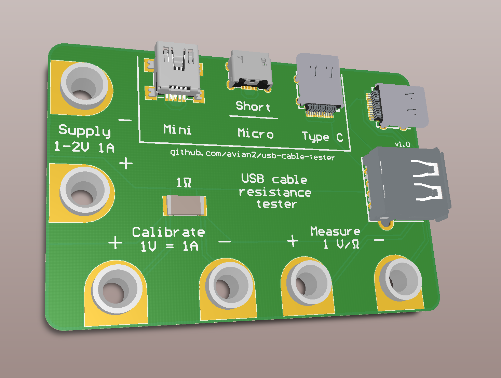

# A tool for measuring USB cable resistance

I'm making a tool for measuring USB cable resistance very similar to the
[FemtoCow's cable resistance tester][1]. I will publish the design files here
as soon as I test a prototype.

In the mean time, you can read my blog post about [measuring USB cables][2].

[1]: https://www.tindie.com/products/FemtoCow/usb-cable-resistance-tester/
[2]: https://www.tablix.org/~avian/blog/archives/2019/06/measuring_usb_cable_resistance/
